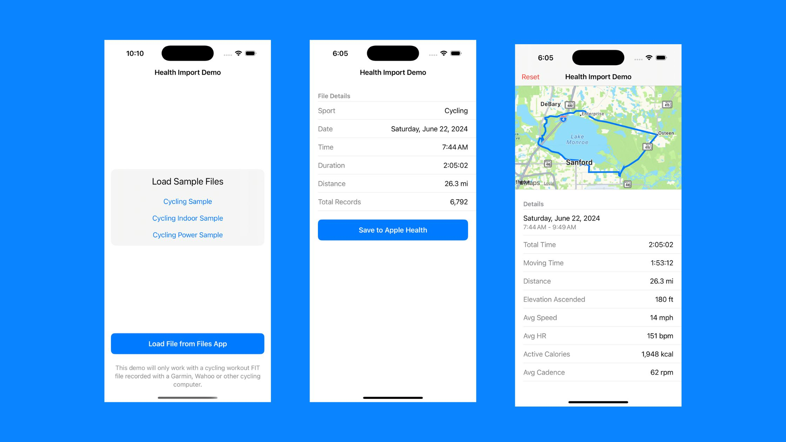

# Apple Health Import Demo App

A demo app showing how to read a FIT file and save a cycling workout to HealthKit.

> [!TIP]
> Check out the full blog post on my website: [How to import a FIT File to HealthKit](https://riveralabs.com/blog/how-to-import-a-fit-file-to-healthkit)

The demo app will:

1. Read a FIT file from a sample file or Files app
2. Parse the FIT file using [FitDataProtocol](https://github.com/FitnessKit/FitDataProtocol)
3. Save the workout data to HealthKit
4. Read the workout from Apple Health and show some details and route

